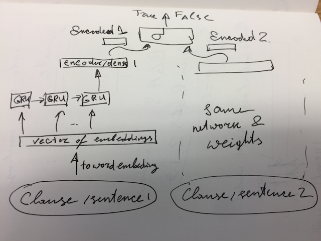

##Sentence to sentence comparison of similarity

1. https://pdfs.semanticscholar.org/236f/ac0df2f093700611321d1b6ceede65e5734c.pdf 
1. https://github.com/brightmart/nlu_sim

Less..
1. https://arxiv.org/pdf/1802.05667.pdf
1. https://arxiv.org/pdf/1805.08353.pdf

##Legal documents
    https://wwwmatthes.in.tum.de/file/1u6tkmymdiu6y/Sebis-Public-Website/-/Extending-Full-Text-Search-for-Legal-Document-Collections-using-Word-Embeddings/La16c.pdf

##Pisaro style, combining style from many paintings?
